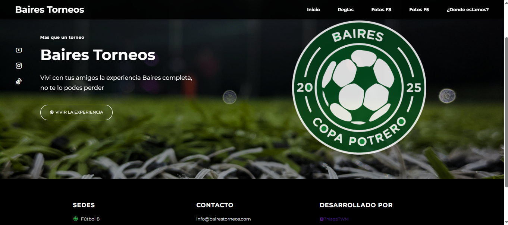

# ⚽ Baires Torneos

🌐 https://bairestorneos.netlify.app

---

## 📌 Descripción / Description

**ES:**  
Baires Torneos es una landing page moderna y responsive desarrollada para promocionar a Baires Torneos que es un torneo de futbol, el cual jugara Copa Potrero 2025. El sitio incluye una presentación visual atractiva, un botón de contacto directo por WhatsApp para inscripciones y una estructura clara que facilita la navegación.

**EN:**  
Baires Torneos is a modern and responsive landing page developed to promote Baires Torneos, which is a football (soccer) tournament that will play Copa Potrero 2025. The site includes an attractive visual presentation, a direct WhatsApp contact button for registrations, and a clear structure that facilitates navigation.
---

## 🛠️ Tecnologías utilizadas / Technologies Used

- HTML5  
- CSS3  
- JavaScript  
- Netlify (deploy)

---

## 💡 Características / Features

- Diseño responsive para todos los dispositivos.  
- Hero section animada con botones de acción.  
- Enlace directo a WhatsApp para inscribirse.  
- Footer con sección de contacto y enlaces.  
- Estructura clara y código organizado.

---

## 🚀 Mejoras respecto a la versión anterior / Improvements over the previous version

- Rediseño completo del sitio con enfoque visual y moderno.  
- Incorporación de animaciones, mejor tipografía y jerarquía visual.  
- Navegación optimizada para dispositivos móviles.  
- Mayor claridad en el llamado a la acción ("Vivir la experiencia").

---

## 📞 Contacto / Contact

📧 agusarg1408@gmail.com  
📱 WhatsApp +54 9 1156307975

---

## 📷 Preview

---

## 📌 Estado del proyecto / Project Status

✅ Finalizado — Activo en producción  
Se aceptan sugerencias o feedback para futuras mejoras.

✅ Completed — Live and in production  
Suggestions or feedback are welcome for future improvements.

---
